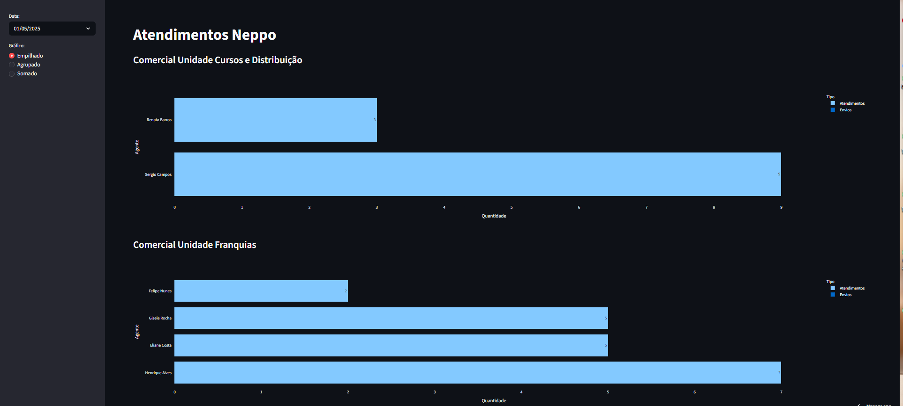

# Neppo Dashboard — Atendimentos

Automação de extração e visualização de dados de atendimentos do Neppo, plataforma omnichannel de atendimento via WhatsApp e outros canais.

## O problema

Os relatórios de atendimentos do Neppo não têm exportação via API. O processo manual exigia login na plataforma, navegação pelos filtros de data, download do CSV e abertura no Excel — repetido toda vez que alguém precisava de dados atualizados.

## A solução

- **coletor.py** — bot Selenium que faz login, aplica os filtros de período e baixa automaticamente os relatórios de sessões e mensagens diretas
- **dashboard.py** — dashboard Streamlit que lê os arquivos gerados e exibe atendimentos por agente, agrupados por unidade comercial, com filtros interativos

O processo que levava minutos de trabalho manual passa a rodar sem intervenção humana.

## Stack

Python · Selenium · Streamlit · Pandas · Plotly · python-dotenv

## Como rodar localmente

1. Clone o repositório
2. Instale as dependências: `pip install -r requirements.txt`
3. Copie `.env.example` para `.env` e preencha com suas credenciais
4. Para gerar dados de demonstração: `python gerar_dados_mock.py`
5. Para rodar o dashboard: `streamlit run dashboard.py`
6. Para rodar o coletor: `python coletor.py`

> O `gerar_dados_mock.py` cria dados fictícios realistas para você testar o dashboard sem precisar de acesso ao Neppo.

## Estrutura

- coletor.py — Automação Selenium
- dashboard.py — Dashboard Streamlit
- gerar_dados_mock.py — Gerador de dados fictícios para demo
- requirements.txt
- .env.example — Template de variáveis de ambiente
- data/ — Relatórios baixados (ignorado pelo git)

## Preview

